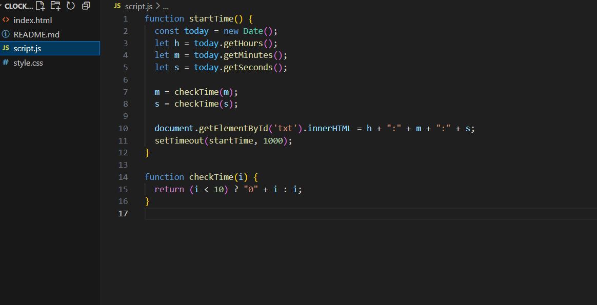

# clock
What I Learned
While making this digital clock : I learned how to work with JavaScript's Date object to retrieve and display the current time. I also practiced using setTimeout() for real-time updates and learned how to add image and video in readme.md..
The feature I enjoyed building the most was the real-time clock update. Watching the time change every second using JavaScript felt satisfying..
What I Would Add Next:The current date below the time also improve style.css

[Watch the demo](demo.mp4)

